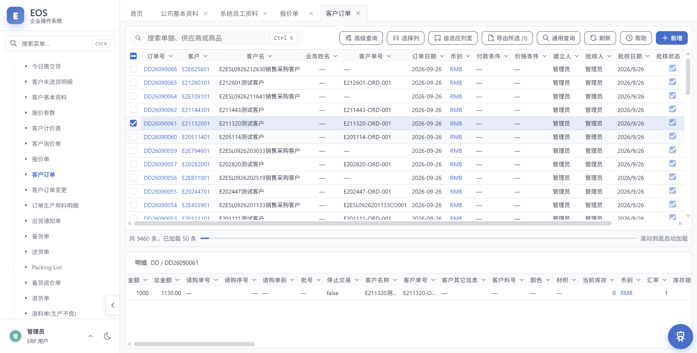
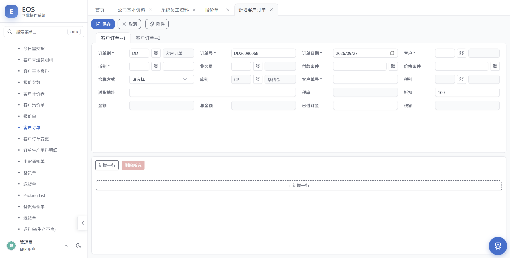
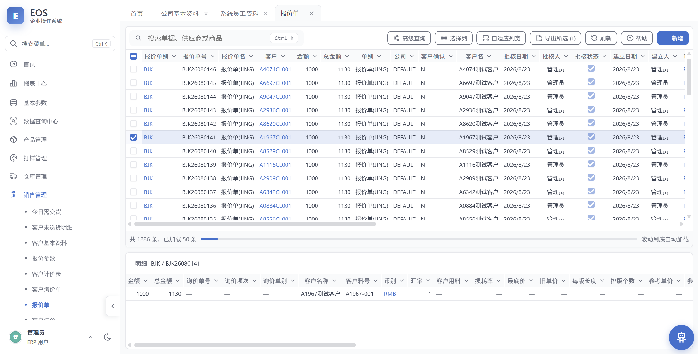
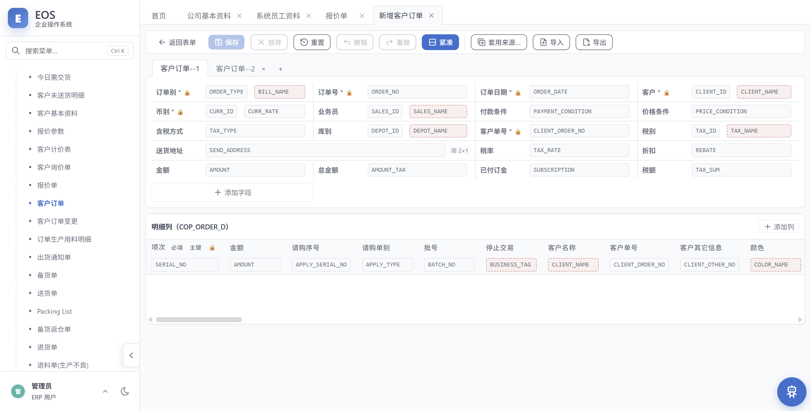
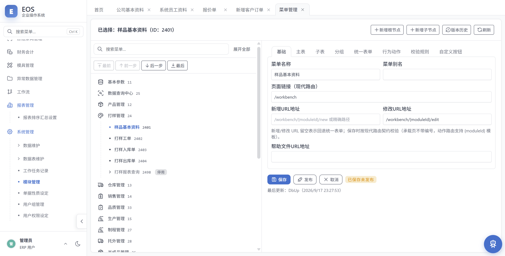
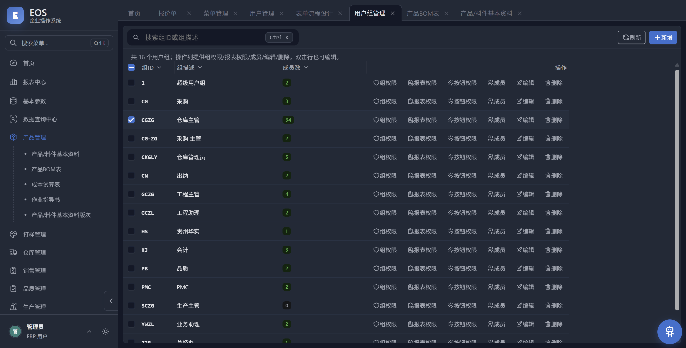

# EOS

一个**元数据驱动**的企业资源计划（ERP）系统：模块菜单、业务字段、列表列、查询条件、报表版式与表单布局
全部由数据库元数据驱动，界面由一套通用工作台按元数据即时生成；业务规则在应用层以确定性的领域服务实现。

> **项目状态：早期开发阶段（v0.2.0）。** 系统功能可运行、可扩展，但尚未经过生产环境验证，
> 表结构与 HTTP 接口仍可能随开发调整。欢迎试用与反馈，暂不建议用于关键业务。
>
> 该版本号由发布脚本写入，与 [`version.json`](./version.json) 一致（本行**不要手改**）；
> 每版的变更见 [`CHANGELOG.md`](./CHANGELOG.md)。

## 系统构成

- `EOS.API/`：ASP.NET Core (.NET 10) 业务 API，所有数据访问与业务规则的唯一入口，
  对动态表名/字段名/查询条件实施服务端白名单与参数化，是系统权限的最终边界；
- `EOS.Web/`：React + TypeScript + Vite 前端，经典 ERP 桌面式工作台界面；
- `db/bootstrap/`：数据库初始化脚本，可在空环境建立一个结构完整、界面齐全、无业务数据的空库。

## 功能概览

- **通用工作台**：单表 / 主子表单据的列表、搜索、选择列、列宽调整、导出、批核状态机与统一表单编辑；
- **权限体系**：用户组与个人权限两级，支持模块操作位、字段级禁止（禁看/禁改/禁新增）、
  数据范围与成本保密控制；
- **元数据管理**：表与字段维护、模块菜单维护、通用查询列配置、数据源与表单布局的配置；
- **报表中心**：报表定义、条件模板、定时生成、订阅收件箱与版式管理；
- **流程审批**：单据批核/解批、流程定义、待办与审批历史；
- **领域模块**：采购、销售、生产、库存、财务、人事等领域单据与业务规则。

## 界面预览

| 单据列表（通用工作台） | 统一表单编辑 |
| --- | --- |
|  |  |

| 报价单 | 版式设计器 |
| --- | --- |
|  |  |

| 菜单与模块管理 | 深色主题 |
| --- | --- |
|  |  |

> 截图为合成测试数据（示例公司、测试客户），用于功能预览。

## 架构概览

```text
EOS.Web ──HTTP──> EOS.API ──SQL──> SQL Server (EOS.ERP)
                     │
                     └── 领域服务 / 元数据仓库 / 权限与审计
```

前端不直连数据库；未来的模型推理、Agent 等调用方同样只经 `EOS.API` 授权访问。
架构细节见 [ARCHITECTURE.md](ARCHITECTURE.md)。

## 快速开始

环境要求：SQL Server 2025+、.NET 10 SDK、Node.js 20+。

1. 初始化数据库（5 个脚本按序执行），见 [db/README.md](db/README.md)；
2. 设置环境变量后启动 `EOS.API`——只有 `MSSQL_ERP_CONN`（业务库连接串，必填）。配置里只写 `${VAR}` 引用，
   真值只存在于环境变量，**连接串不落文件**。**工作助手的配置不在 `appsettings` 里**：模型与供应商在
   「工作助手管理 → 模型与用量」配，密钥由那个界面写进环境变量（库里只存变量名），见 ADR-030 §8；
3. 启动前端开发服务器。

完整步骤见 [QUICKSTART.md](QUICKSTART.md)。

## 默认账号

初始化脚本会创建唯一账号 `admin`（口令 `admin`），拥有全部模块与报表权限。
**首次登录后请立即修改口令。**

## 数据与元数据

- 仓库不含任何业务数据。建库脚本发布的是**结构 + 元数据 + 一个管理员账号**：
  菜单、字段登记、查询列、报表与表单版式随仓库发布，单据与主档数据全部为空；
- 业务表在空库中建立后由使用者在界面中自行录入；
- 结构变更随 `EOS.API/Data/Migrations/` 下的版本化脚本发布，
  应用启动时由 DbUp 自动应用到数据库，日志记录在 `dbo.ERP_SCHEMA_JOURNAL`。

## 代码约定

- 数据库对象一律全大写命名；动态表/列/排序与查询字段只来自服务端白名单或元数据；
- 动态查询使用结构化条件与参数化 SQL，禁止拼接用户输入；
- 仓库代码读取数据库元数据一律使用 `sys.*` 目录视图。

## 参与贡献

见 [CONTRIBUTING.md](CONTRIBUTING.md)。

## 许可证

[MIT](LICENSE)

## 第三方组件

本项目使用若干开源组件（PDF 生成、中文字体、UI 与状态管理库等）。
各组件的许可与约束登记在 [THIRD-PARTY-NOTICES.md](THIRD-PARTY-NOTICES.md)。

其中 **QuestPDF** 采用 Community License（双许可模式，非标准开源许可），
对年营收超过 100 万美元的组织、公共部门与上市公司不适用——
**下游使用者需自行确认是否落在适用范围内**。
